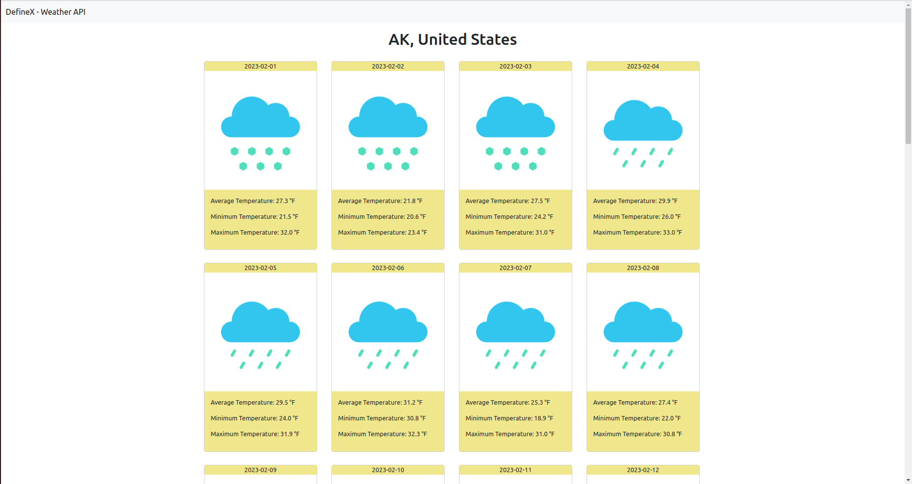
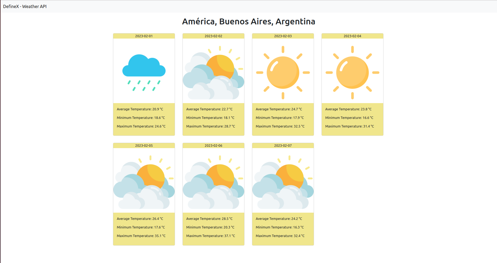
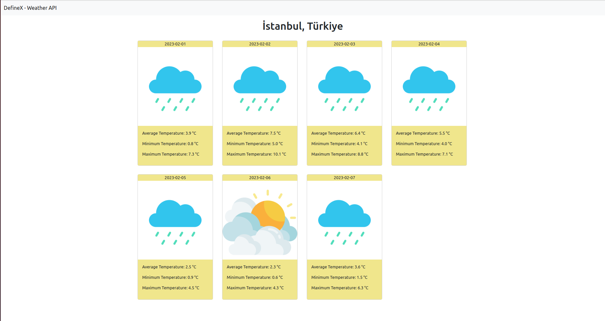
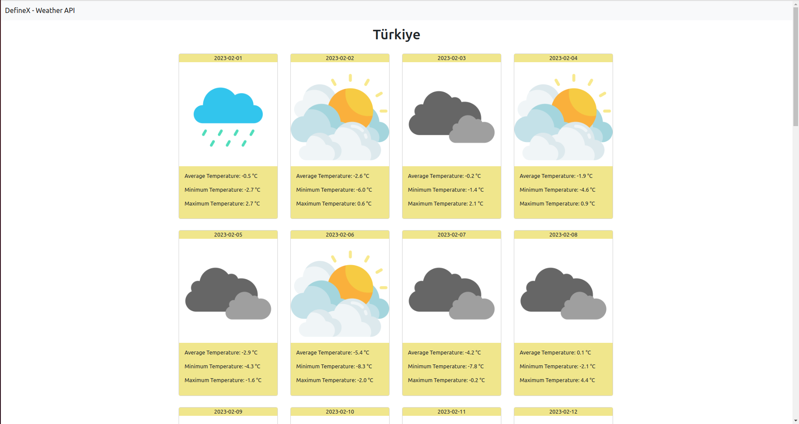

## Assignment 3 - Weather API - Content
We're going to make a weather API. There are lots of free APIs on the internet for this. We have included some API websites below. You can use other APIs if you wish.

https://openweathermap.org/api

https://www.weatherapi.com/

https://weatherstack.com/

Our main goal is to write an API to communicate with these APIs. Let's show the daily, weekly and monthly weather report according to the country / city information that we will get from the user.

The request will first come to the API you will write, then after you receive the request, you will request the Free Weather APIs and return this information.

You can use the very easy to use RestTemplate class for this process.

### What is expected of you

- Extracting a correct API structure.
- Making validations on your model or parameters.
- Exception handling operations.

### Description

{location} = https://www.visualcrossing.com/ (All locations supported by API)

{temperatureType} = Celsius, Fahrenheit (Default Celsius)

{time} = day, week, month (Default day)

### The URI

```bash
/v1/weather

/v1/weather/{location}

/v1/weather/{location}/{temperatureType}

/v1/weather/byTime/{location}/{time}

/v1/weather/byTime/{location}/{time}/{temperatureType}
```

### The URI for Thymeleaf

```bash
/v1/weather/interface/{location}

/v1/weather/interface/{location}/{temperatureType}

/v1/weather/interface/byTime/{location}/{time}

/v1/weather/interface/byTime/{location}/{time}/{temperatureType}
```








